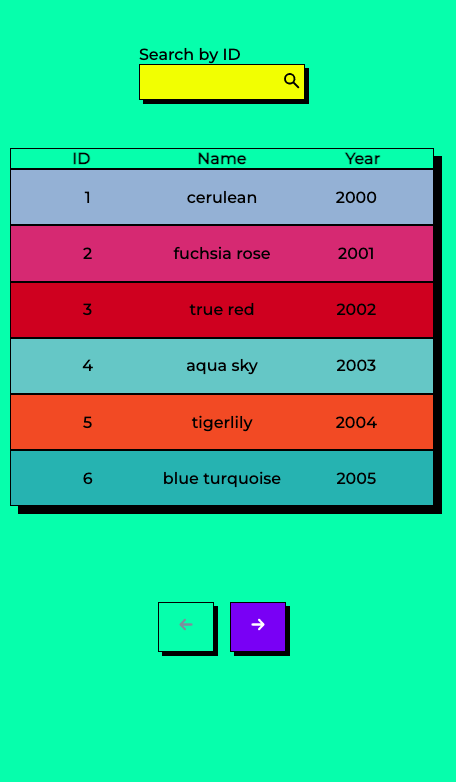

[![LinkedIn][linkedin-shield]][linkedin-url]

<h3 align="center">Codibly Task</h3>

  

    Front-end project
     
     
    <a href="">View Demo</a>
    ·
    <a href="https://github.com/malgo-slota/codibly-task/issues">Report Bug</a>
  

  

    
  

<!-- TABLE OF CONTENTS -->

  
Table of Contents

  <ol>
    <li>
      <a href="#about-the-project">About The Project</a>
      <ul>
        <li><a href="#built-with">Built With</a></li>
        <li><a href="#getting-started">Create react app</a></li>
      </ul>
    </li>
    <li><a href="#usage">Usage</a></li>
    <li><a href="#continued-development">Continued development</a></li>
    <li><a href="#contact">Contact</a></li>
  </ol>

<!-- ABOUT THE PROJECT -->
## About The Project

The main goal was to implement SPA application that takes API endpoint to display paginated list of products and lets to search them by inserting ID, and it is fulfilled. 
Colors taken from API remind me neo-brutalism UX trend, so I decided to go in this direction instead using for this styling library. For icons, I used the react-icons library. I chose to use SASS since I consider it the cleanest/easy to read
because of its nested syntax. 

(<a href="#readme-top">back to top</a>)

### Built With

(<a href="#readme-top">back to top</a>)

### Getting Started

This project was bootstrapped with [Create React App](https://github.com/facebook/create-react-app).

#### Available Scripts

In the project directory, you can run:

##### `npm start`

Runs the app in the development mode.\
Open [http://localhost:3000](http://localhost:3000) to view it in your browser.

The page will reload when you make changes.\
You may also see any lint errors in the console.

##### `npm test`

Launches the test runner in the interactive watch mode.\
See the section about [running tests](https://facebook.github.io/create-react-app/docs/running-tests) for more information.

##### `npm run build`

Builds the app for production to the `build` folder.\
It correctly bundles React in production mode and optimizes the build for the best performance.

The build is minified and the filenames include the hashes.\
Your app is ready to be deployed!

See the section about [deployment](https://facebook.github.io/create-react-app/docs/deployment) for more information.

(<a href="#readme-top">back to top</a>)

<!-- USAGE EXAMPLES -->
## Usage

- search data by passing ID
- display modal by clicking on a particular row with more data
- switch between pages
- display the loading spinner when data is taken from API
- display error status

(<a href="#readme-top">back to top</a>)

<!-- ROADMAP -->
## Continued development

- reflect pagination and filtering in URL address
- using useReducer to manage more complex state logic

(<a href="#readme-top">back to top</a>)

<!-- CONTACT -->
## Contact

- LinkedIn - [Małgorzata Słota](https://www.linkedin.com/in/malgorzata-slota/)

(<a href="#readme-top">back to top</a>)

[linkedin-shield]: https://img.shields.io/badge/-LinkedIn-black.svg?style=for-the-badge&logo=linkedin&colorB=555
[linkedin-url]: https://linkedin.com/in/othneildrew

